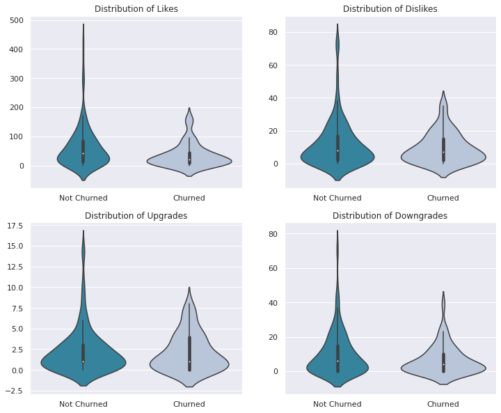
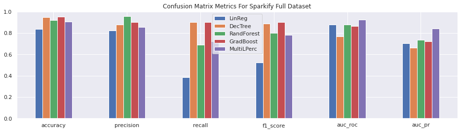

# Churn Prediction with PySpark

This is the Capstone Project for the Data Scientist Nanodegree with Udacity.

For a description see the [Medium](https://medium.com/@silviaonofrei/predict-churn-with-pyspark-b7cfe2fa139e) blog.

## Table of Contents
* [General Information](#general-information)
* [Technologies Used](#technologies-used)
* [Cloud Settings](#cloud)
* [Local Installation Setup](#setup)
* [Screenshots](#screenshots)
* [Acknowledgements](#acknowledgements)
<!-- * [License](#license) -->

## General Information

Predicting churn is an essential aspect for any online subscription business, such as a streaming music platform. In the present project, we are investigating and predicting churn for a fictional music platform called Sparkify.

## Cloud Settings

To train the full dataset I used an AWS-EMR cluster with the following configurations:
- release label: emr-5.30.1
- applications: PySpark 2.4.5, Zepelin 0.8.2
- instance type: m5.xlarge
- number of instances: 5 (1 master, 4 cores)

## Local Instalation Setup

The code is written on Anaconda Jupyter Notebook with a Python 3 kernel. Additional libraries and modules:
- PySpark 3.1.2
- Pandas 1.3.4
- Numpy 1.21.2
- Matplotlib 3.5.0
- Seaborn 0.11.2
Full list to set up an environment can be found in the requirements.txt file.

## Screenshots

<!-- If you have screenshots you'd like to share, include them here. -->

## Project Structure
------------

    ├── LICENSE
    ├── README.md          <- The top-level README for developers using this project.
    │
    ├── Sparkify_Data_Description.ipynb <- univariate analysis on small dataset
    notebooks - Python 3 kernel.                      
    |── Sparkify_FullDataset_AWS.ipynb   <- EDA, data processing and modeling on full dataset - PySpark kernel.
    |── Sparkify_Small_Dataset.ipynb <- EDA, dataprocessing and modeling on small dataset, includes visualizations, Python 3 kernel.
    │  
    ├── images            <- Generated graphics to be used in reporting.
    │  
    ├── requirements.txt   <- The requirements file for reproducing the analysis environment.
    │
    ├── reports           <- Static files of the notebooks.
    |
    ├── .gitignore      <- Files to be ignored by Git.
    └──

## Acknowledgements

- Many thanks to Udacity who suggested the problem and provided the interesting datasets.

<!-- Optional -->
<!-- ## License -->
<!-- This project is open source and available under the [... License](). -->

<!-- You don't have to include all sections - just the one's relevant to your project -->
