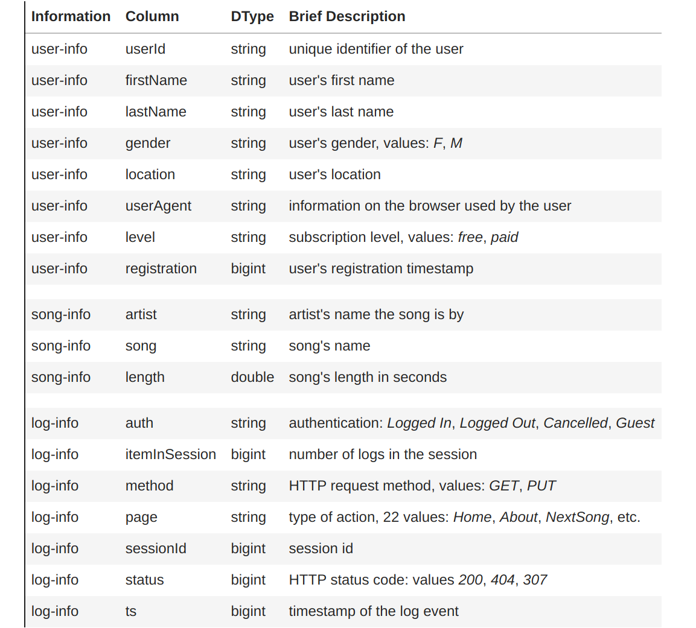
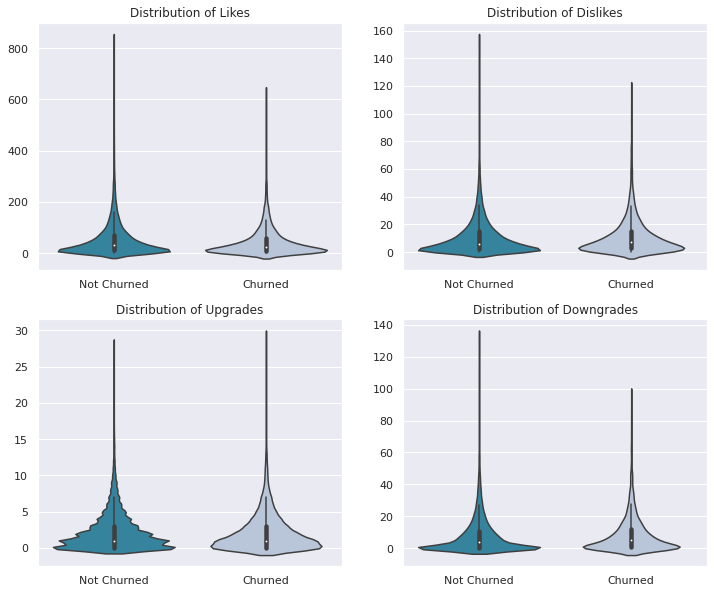
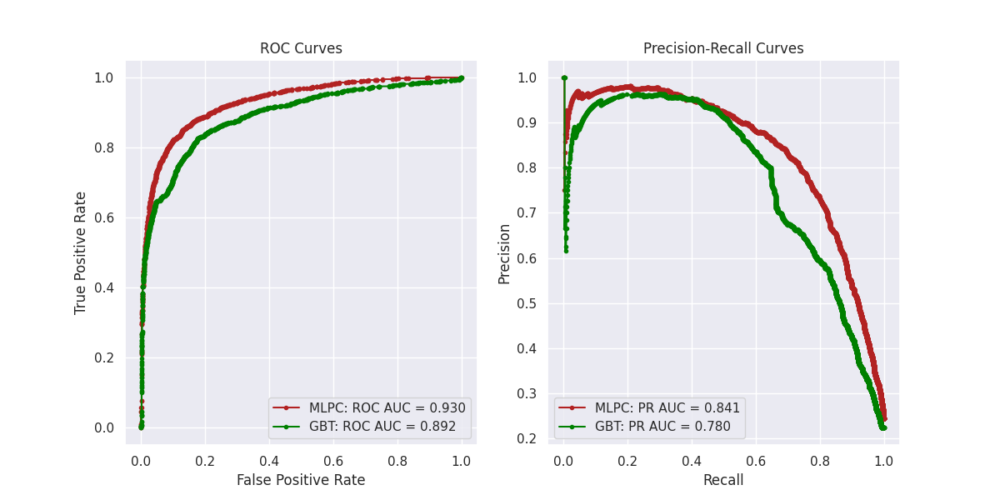
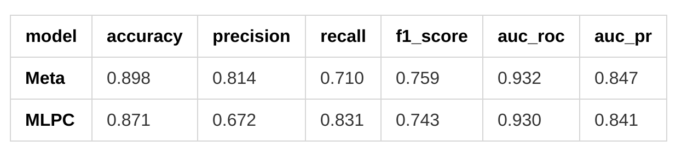

# User Activity Based Churn Prediction With PySpark on an AWS-EMR Cluster

This is an updated and extended version of the capstone project for the Data Scientist Nanodegree with Udacity.

There are two Medium blogs related to this project:
- [User Activity Based Churn Prediction With PySpark on an AWS-EMR Cluster](https://medium.com/@silviaonofrei/user-activity-based-churn-prediction-with-pyspark-on-an-aws-emr-cluster-b7cfe2fa139e)
- [Did Stacking Improve My PySpark Churn Prediction Model?](https://medium.com/@silviaonofrei/did-stacking-improve-my-pyspark-churn-prediction-model-230bdf3b9675)

## Table of Contents
* [General Information](#general-information)
* [Technologies Used](#technologies-used)
* [Cloud Settings](#cloud)
* [Local Installation Setup](#setup)
* [Screenshots](#screenshots)
* [Acknowledgements](#acknowledgements)
<!-- * [License](#license) -->

## General Information

In the present project, we are investigating and predicting churn for a fictional music platform called Sparkify. This is a binary classification problem, in which the algorithm has to identify which users are most likely to churn.

## AWS-EMR Cluster Settings

To train the full dataset I used an AWS-EMR cluster with the following configurations:
- release label: emr-5.33.1
- applications: PySpark 2.4.7, Livy 0.7.0
- instance type: m5.xlarge
- number of instances: 7 (1 master, 6 cores)
- bootstrap: `emr_bootstrap_modeling.sh`
- configuration file: `emr_configuration_modeling.json`

The project was run on EMR Notebooks with PySpark kernels.

## Local Instalation Setup

The code is written on Anaconda Jupyter Notebook with a Python3 kernel. Additional libraries and modules used:
- PySpark 3.1.2
- Pandas 1.3.4
- Numpy 1.21.2
- Matplotlib 3.5.0
- Seaborn 0.11.2

Full packages and libraries list to set up an environment can be found in the *requirements.txt* file.

## Screenshots

The structure of the raw data:

<!-- If you have screenshots you'd like to share, include them here. -->

Users' activity can be measured by the number of likes and dislikes, upgrades and downgrades of the service:

The Kendall correlation rank, displayed below as a heatmap, assists in determining the feature relevance for modeling:

The performance of the two best models: Gradient Boosted Trees and the Multilayer Perceptron are displayed using ROC and PR curves:

Table to compare the preformance metrics of the Multilayer Perceptron and of the Meta Classifier Linear Regression model:

## Project Structure

Two datasets were used for this project, both too large to store on Github. The notebooks named `Sparkify_Small_Data*` refer to work done on the small datset of 128 MB. THe notebooks named `Sparkify_Full_Data*` refer to work done with the full dataset of 12 GB.

The specification `AWS` means that the notebook is downloaded from AWS-EMR and has a PySpark kernel.

There are three independent versions of the project:

- `V1` - the data is preprocessed and modeled by 5 classifiers, each classifier is fitted with 5-fold cross validation and the hyperparameters are tuned via GridSearch, the best hyperparameter combination for each model is evaluated on the test set;

- `V2` - the data is processed as in `V1`, several features are removed to eliminate redundancies, there are 6 classifiers that are spot checked on the train set using 5-fold cross validation and default parameters, the best two classifiers (GBT and MLPC) are fine tuned with GridSearch and evaluated on the test set;

- `V3` - the preprocessed data is modeled using a stacked model that consists of 6 classifiers as base predictors and a Linear Regression meta-classifier.

------------

    ├──LICENSE
    ├──README.md         <- The top-level README for developers.
    │
    ├──notebooks
        ├──fullDataNotebooks
            ├──Sparkify_Full_Data_AWS_V1.ipynb
            ├──Sparkify_Full_Data_Description_AWS_V2.ipynb
            ├──Sparkify_Full_Data_Wrangling_V2.ipynb
            ├──Sparkify_Full_Data_AWS_V2.ipynb
            ├──Sparkify_Full_Data_Stacking_AWS_V3.ipynb
            ├──Sparkify_Full_Data_Stacking_AWS_V4.ipynb
        ├──fullDataNotebooks
            ├──Sparkify_Small_Data_Local_V1.ipynb
            ├──Sparkify_Small_Data_Description_V2.ipynb
            ├──Sparkify_Small_Data_Wrangling_V2.ipynb
            ├──Sparkify_Small_Data_Modeling_V2.ipynb
            ├──Sparkify_Small_Data_Stacking_V3.ipynb
    │
    ├──reports
        |── Churn_Prediction_Report.html  <- Report of the project (V2).
        |── Churn_Prediction_Report.pdf  <- Report of the project (V2).
        |── Churn_Stacking_Report.html      <- Report of the project (V3).
        |── Churn_Stacking_Report.pdf      <- Report of the project (V3).
        |── References.html               <- List of sources for the project.
        |── References.pdf               <- List of sources for the project.  
        |
        ├──fullDataReports - static versions of notebooks
            ├──Sparkify_Full_Data_AWS_V1.html
            ├──Sparkify_Full_Data_Description_AWS_V2.html
            ├──Sparkify_Full_Data_Wrangling_V2.html
            ├──Sparkify_Full_Data_AWS_V2.html
            ├──Sparkify_Full_Data_Stacking_AWS_V3.html
        ├──fullDataNotebooks - static versions of notebooks
            ├──Sparkify_Small_Data_Local_V1.html
            ├──Sparkify_Small_Data_Description_V2.html
            ├──Sparkify_Small_Data_Wrangling_V2.html
            ├──Sparkify_Small_Data_Modeling_V2.html
            ├──Sparkify_Small_Data_Stacking_V3.htm
    |          
    |──scripts
        ├──churn_evaluators_script.py      <- Functions to build model evaluators.
        ├──churn_modeling_script.py        <- Pipelines and functions for modeling.
        ├──churn_prepdata_script.py        <- Clean and prepare data functions.
        ├──emr_bootstrap_modeling.sh       <- Bootstrap file for AWS cluster.
        ├──emr_configuration_modeling.json <- Configuration file for AWS cluster.
    │  
    ├── images            <- Generated graphics to be used in reporting.
    │  
    ├── requirements.txt  <- File for reproducing the local environment.
    |
    ├── References.md     <- List of sources used in the project.
    |
    ├── .gitignore        <- Files to be ignored by Git.
    └──

## Acknowledgements

Many thanks to Udacity who suggested the problem and provided two interesting datasets.

<!-- Optional -->
<!-- ## License -->
<!-- This project is open source and available under the [... License](). -->

<!-- You don't have to include all sections - just the one's relevant to your project -->
